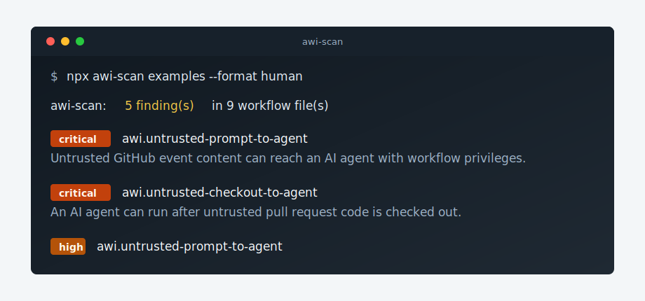

# awi-scan

[](https://github.com/gnim81/awi-scan/actions/workflows/ci.yml)
[](https://www.npmjs.com/package/awi-scan)
[](https://github.com/gnim81/awi-scan/releases)
[](LICENSE)

Detect Agentic Workflow Injection risks in GitHub Actions workflows.

Agentic Workflow Injection happens when untrusted GitHub text, such as a pull request body or issue comment, is sent to an AI coding agent that runs with repository privileges. `awi-scan` looks for that source-to-agent-to-privilege path before the agent runs.

`awi-scan` runs locally and offline. It does not send workflow contents to an external service.



```bash
npx awi-scan . --format human
```

```text
awi-scan: 5 finding(s) in 9 workflow file(s)

critical awi.untrusted-prompt-to-agent examples/vulnerable/pull-request-target-agent.yml:1:1
  Untrusted GitHub event content can reach an AI agent running with workflow privileges.

critical awi.untrusted-checkout-to-agent examples/vulnerable/pull-request-target-checkout-agent.yml:1:1
  An AI agent can run after untrusted pull request code is checked out in a privileged workflow.

high awi.untrusted-prompt-to-agent examples/vulnerable/gemini-issue-agent.yml:1:1
  Untrusted GitHub event content can reach an AI agent running with workflow privileges.
```

## Example Finding

```yaml
name: vulnerable pull request agent
on:
  pull_request_target:
permissions:
  contents: write
jobs:
  agent:
    runs-on: ubuntu-latest
    steps:
      - uses: anthropics/claude-code-action@v1
        with:
          prompt: ${{ github.event.pull_request.body }}
```

`awi-scan` reports this because untrusted pull request text reaches an agent while the workflow has write permissions.

```text
critical awi.untrusted-prompt-to-agent .github/workflows/danger.yml:10:1
  Untrusted GitHub event content can reach an AI agent running with workflow privileges.
```

## Safer Pattern

Run agents on trusted triggers, keep permissions read-only by default, and require a maintainer-controlled approval boundary before using untrusted text.

```yaml
on:
  workflow_dispatch:
permissions:
  contents: read
```

## GitHub Action

```yaml
name: awi-scan
on: [pull_request]
permissions:
  contents: read
  security-events: write
jobs:
  scan:
    runs-on: ubuntu-latest
    steps:
      - uses: actions/checkout@v4
      - uses: gnim81/awi-scan@v0.2.0
        with:
          fail-on: high
```

## CLI

```bash
npx awi-scan --format human
npx awi-scan --format json --output awi-scan.json
npx awi-scan --format sarif --output awi-scan.sarif
npx awi-scan --fail-on critical
npx awi-scan rules
npx awi-scan explain awi.untrusted-prompt-to-agent
```

## What It Detects

- Untrusted issue, PR, comment, review, or discussion text.
- Event payload reads through `GITHUB_EVENT_PATH`, `gh`, `curl`, or GitHub API calls.
- Agent actions and agent CLI invocations.
- Untrusted pull request head checkouts before agent execution.
- Dangerous contexts such as `pull_request_target`, write permissions, secrets, OIDC, and self-hosted runners.

See [Threat Model](docs/threat-model.md) and [Rules](docs/rules.md) for details.

## Project

- Supported agent patterns: [docs/agent-actions.md](docs/agent-actions.md)
- Safe `pull_request_target` patterns: [docs/pull-request-target.md](docs/pull-request-target.md)
- SARIF upload: [docs/sarif-upload.md](docs/sarif-upload.md)
- False positives: [docs/false-positives.md](docs/false-positives.md)
- Security reports: [SECURITY.md](SECURITY.md)
- Contributing: [CONTRIBUTING.md](CONTRIBUTING.md)
- Examples: [docs/examples.md](docs/examples.md)

## License

MIT
